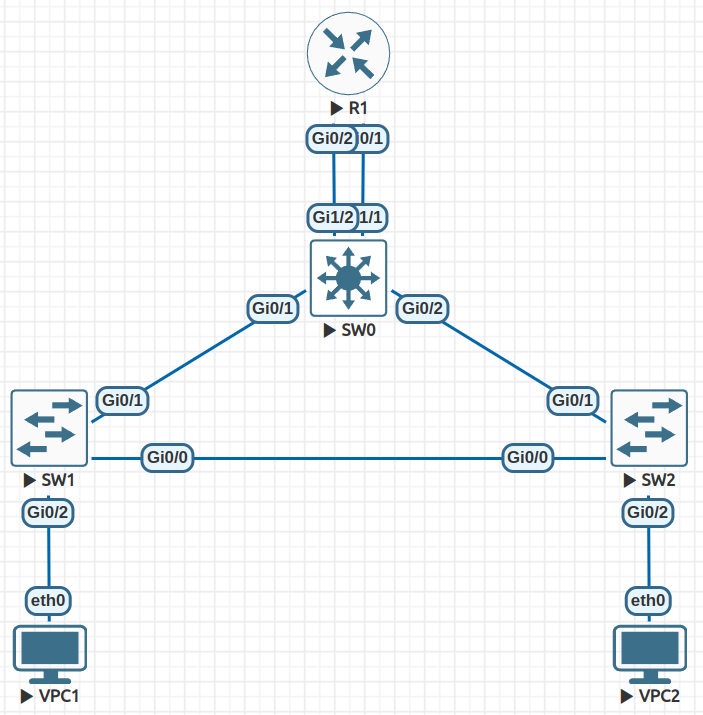

# Казимов Сулейман Патрисович



## Использованные команды
#### VPC1
```
set pcname VPC1
ip 10.0.10.1/24 10.0.10.254
save
```

#### VPC2
```
set pcname VPC2
ip 10.0.20.1/24 10.0.20.254
save
```

#### SW0
```
enable
configure terminal
interface range g0/1, g0/2
switchport trunk encapsulation dot1q
switchport mode trunk
exit
vlan 10
exit
vlan 20
exit
interface g1/1
switchport mode access
switchport access vlan 10
exit
interface g1/2
switchport mode access
switchport access vlan 20
exit
spanning-tree vlan 10 root primary
spanning-tree vlan 20 root primary
exit
write memory
```

#### SW1
```
enable
configure terminal
vlan 10
exit
vlan 20
exit
interface g0/2
switchport mode access
switchport access vlan 10
exit
interface range g0/0, g0/1
switchport trunk encapsulation dot1q
switchport mode trunk
exit
exit
write memory
```

#### SW2
```
enable
configure terminal
vlan 10
exit
vlan 20
exit
interface g0/2
switchport mode access
switchport access vlan 20
exit
interface range g0/0, g0/1
switchport trunk encapsulation dot1q
switchport mode trunk
exit
exit
write memory
```

#### R1
```
enable
configure terminal
interface g0/1
ip address 10.0.10.254 255.255.255.0
no shutdown
exit
interface g0/2
ip address 10.0.20.254 255.255.255.0
no shutdown
exit
ip routing
exit
write memory
```

## Примеры работы
#### 1. Без разрывов сети:

```
VPC1> ping 10.0.20.1 -c 1

84 bytes from 10.0.20.1 icmp_seq=1 ttl=63 time=20.104 ms
```
```
VPC2> ping 10.0.10.1 -c 1

84 bytes from 10.0.10.1 icmp_seq=1 ttl=63 time=17.561 ms
```

#### 2. Разрыв между SW1 и SW2
```
VPC1> ping 10.0.20.1 -c 1

84 bytes from 10.0.20.1 icmp_seq=1 ttl=63 time=16.540 ms
```
```
VPC2> ping 10.0.10.1 -c 1

84 bytes from 10.0.10.1 icmp_seq=1 ttl=63 time=16.506 ms
```

#### 3. Разрыв между SW0 и SW1
```
VPC1> ping 10.0.20.1 -c 1

84 bytes from 10.0.20.1 icmp_seq=1 ttl=63 time=12.573 ms
```
```
VPC2> ping 10.0.10.1 -c 1

84 bytes from 10.0.10.1 icmp_seq=1 ttl=63 time=11.517 ms
```


#### 3. Разрыв между SW0 и SW2
```
VPC1> ping 10.0.20.1 -c 1

84 bytes from 10.0.20.1 icmp_seq=1 ttl=63 time=12.676 ms
```
```
VPC2> ping 10.0.10.1 -c 1

84 bytes from 10.0.10.1 icmp_seq=1 ttl=63 time=13.478 ms
```

